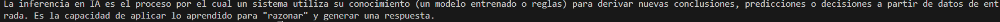
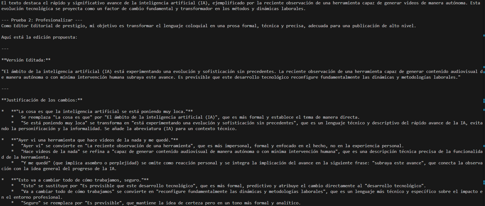
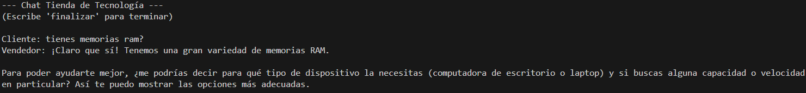
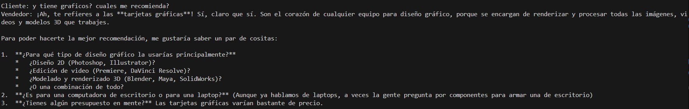
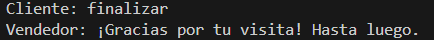

# Taller Práctico 2 - Desarrollo de Aplicaciones con IA

Este repositorio contiene la solución al Taller Práctico 2 de la asignatura "Desarrollo de aplicaciones con IA". El proyecto demuestra el uso de la API de Google GenAI para diferentes tareas, como generación de texto simple, roles específicos (editor editorial) y un chatbot con contexto (vendedor de tecnología).

## Tabla de Contenidos
- [Requisitos Previos](#requisitos-previos)
- [Instalación y Configuración del Entorno](#instalación-y-configuración-del-entorno)
- [Instalación de Librerías](#instalación-de-librerías)
- [Configuración de la API Key](#configuración-de-la-api-key)
- [Descripción de los Scripts y Funcionamiento](#descripción-de-los-scripts-y-funcionamiento)

## Requisitos Previos

- Python 3.8 o superior.
- Una cuenta de Google Cloud con acceso a la API de Gemini (AI Studio).

## Instalación y Configuración del Entorno

Sigue estos pasos para configurar el proyecto en tu máquina local:

1. **Clonar el repositorio:**
   ```bash
   git clone <URL_DEL_REPOSITORIO>
   cd TallerPractico2
   ```

2. **Crear un entorno virtual:**
   Es recomendable usar un entorno virtual para aislar las dependencias.

   - En Windows:
     ```bash
     python -m venv env
     .\env\Scripts\activate
     ```
   - En macOS/Linux:
     ```bash
     python3 -m venv env
     source env/bin/activate
     ```

## Instalación de Librerías

Una vez activado el entorno virtual, instala las dependencias necesarias que se encuentran en el archivo `requeriments.txt`:

```bash
pip install -r requeriments.txt
```

Las principales librerías utilizadas son:
- `google-genai`: Cliente oficial para interactuar con los modelos Gemini de Google.
- `python-dotenv`: Para cargar variables de entorno desde un archivo `.env`.

python.exe -m pip install --upgrade pip (PARA ACTUALIZAR)

pip install requests (PARA INSTALAR)

pip install google-genai (PARA INSTALAR GOOGLE-GENAI)


## Configuración de la API Key

El proyecto utiliza variables de entorno para gestionar la clave de la API de forma segura.

**IMPORTANTE:** Por razones de seguridad, el archivo `.env` que contiene las claves privadas **NO** se incluye en el repositorio. Debes crearlo manualmente.

1. En la raíz del proyecto, crea un nuevo archivo llamado `.env`.
2. Abre el archivo y agrega tu API Key con el siguiente formato:

```env
GENAI_API_KEY=tu_clave_de_api_aqui
```
En Google Studio, creas tu appi key y la copias en tu propio .env
https://aistudio.google.com

## Descripción de los Scripts y Funcionamiento

A continuación se describen los tres scripts principales y se muestra qué hacen (simulando las imágenes de funcionamiento).

### 1. `app_1.py`: Conexión Básica

Este script establece una conexión simple con el modelo `gemini-2.5-flash`. Su función es solicitar una definición breve sobre "Inferencia en IA".

**Funcionamiento esperado:**
El script envía el prompt y recibe una respuesta concisa de menos de 50 palabras.


Muestra como el asistente explica que es Inferencia en IA en 50 palabras.

### 2. `app_2.py`: Editor Editorial (Roles y Tareas)

Este script simula ser un "Editor Editorial de prestigio". Tiene dos funciones principales:
- **Resumir**: Genera un resumen ejecutivo de un texto dado.
- **Profesionalizar**: Reescribe un texto para darle un tono formal y técnico.

Utiliza `system_instruction` para definir el rol y configuraciones de `temperature` para controlar la creatividad.


Muestra como el asistenete traduce un texto informal a uno profesional y lo resume adecuadamente.

### 3. `app_3.py`: Chatbot Vendedor de Tecnología

Este script implementa un chatbot interactivo que actúa como un vendedor amable de una tienda de tecnología.
- **System Instruction**: Define el comportamiento servicial.
- **Few-shot Learning (Historial)**: Se le proporciona un historial de conversación previo (ejemplos de preguntas y respuestas) para que entienda el tono y el tipo de productos que vende.
- **Bucle interactivo**: Permite al usuario chatear continuamente hasta escribir "finalizar".

 Muestra una pregunta del cliente.
 Muestra otra pregunta del cliente.
 Muestra como el cliente finaliza en asistente.